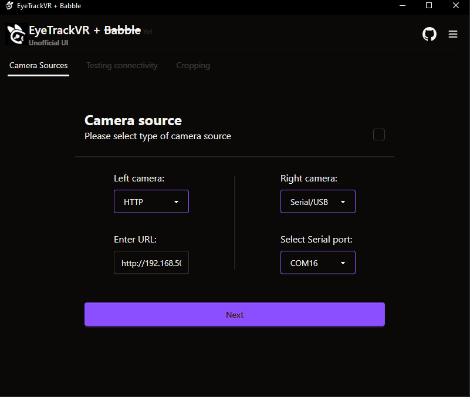
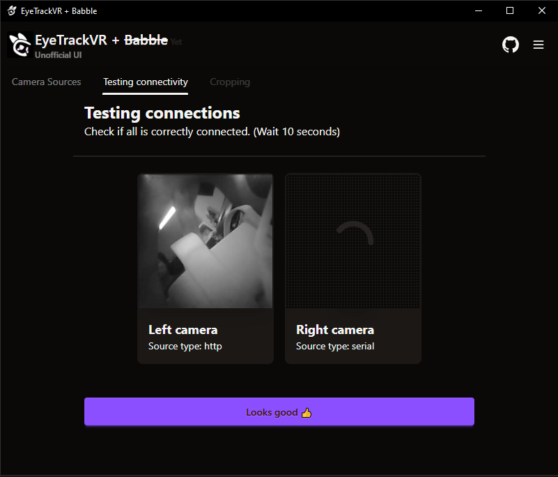
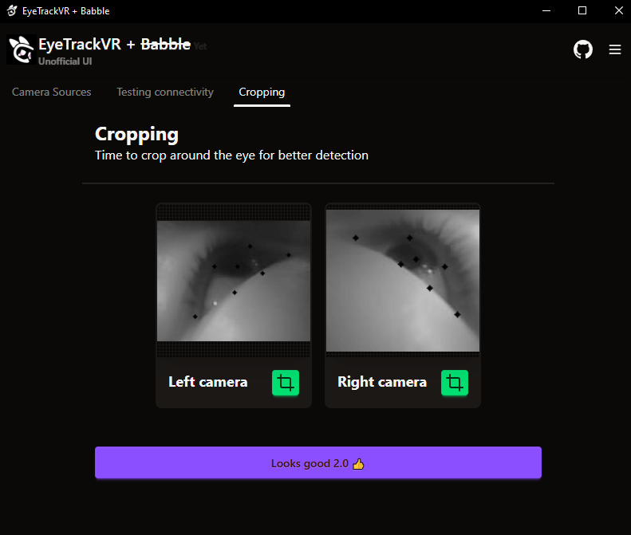
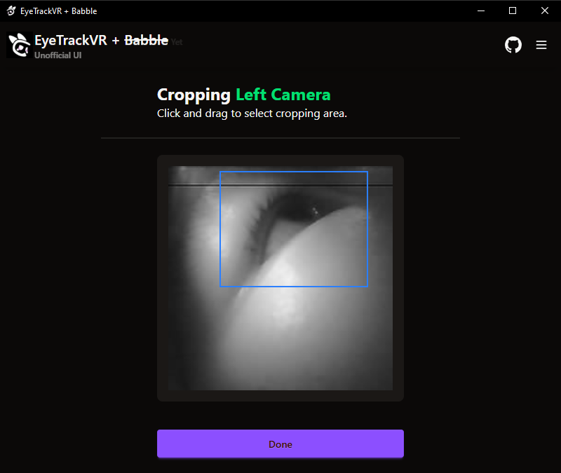
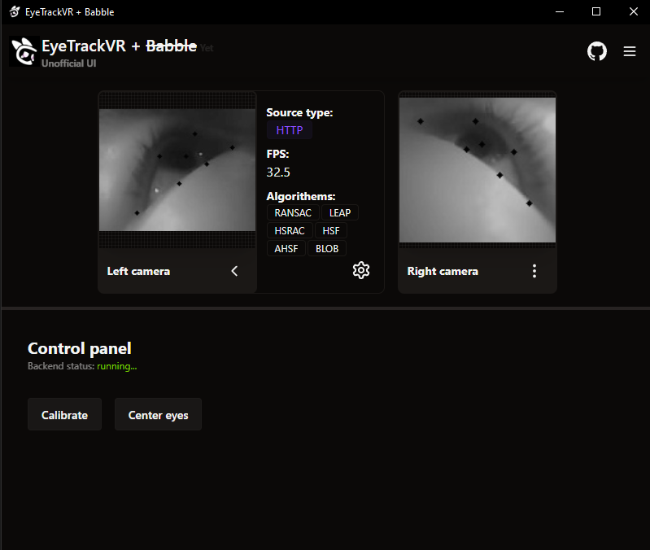
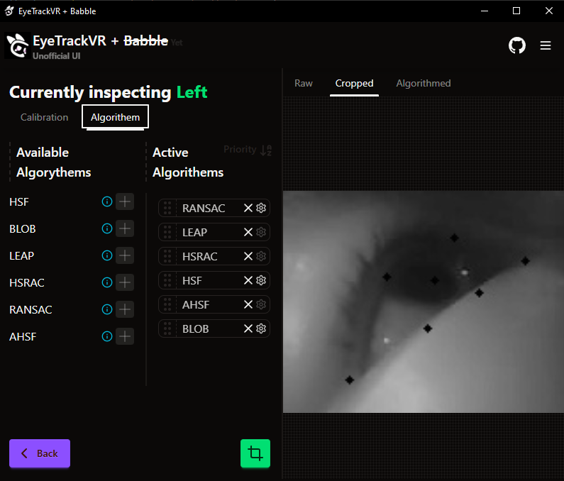

This is an alternative UI for [ETVR](https://github.com/EyeTrackVR/EyeTrackVR).
A lot of the features of ETVR is still not supported, since the backend doens't support it yet.
This project has been a solo adventure, but I am hopeful to collaborate with others.

As soon as [Project: Babble](https://github.com/Project-Babble/ProjectBabble) gets some kind of backend version.
I will intergrate it into ComboFT. 
My idea is merge ETVR and Project: Babble into one program, because having 2 programs is really annoying.

# Preview
<table>
  <tr>
    <td> </td>
    <td>  </td>
</tr> 
   <tr>
      <td></td>
      <td>
  </td>
  </tr>
  <tr>
      <td></td>
      <td>
  </td>
</table>
###### Note: It is really likely that a lot of this will change.


# How to run
This is how i run the UI. There definitely exists a better way.
### Requirements
- Python (for back-end)
- MiniConda or poetry (for back-end)
- pnpm
- Rust
- Node?

## Linux Mint
```
sudo apt update
sudo apt install libwebkit2gtk-4.1-dev \
  build-essential \
  curl \
  wget \
  file \
  libxdo-dev \
  libssl-dev \
  libayatana-appindicator3-dev \
  librsvg2-dev
```
Then continue with the commands below.

## Windows
Check: https://v2.tauri.app/start/prerequisites/#windows \
Then continue with the commands below.


### Download
```
git clone --recurse-submodules https://github.com/MagicBOTAlex/learningTauri.git
cd learningTauri
git submodule add https://github.com/MagicBOTAlex/ETVR-Backend.git ETVR-Backend

:: You can either use conda or poetry, but I use conda on my Windows, and I use poetry on my Linux mint
conda env create -f environment.yml
```
#### Run
Use 2 consoles. 
First tauri
```
pnpm install
pnpm tauri dev
```
back-end:
```
conda activate etvr
:: or
poetry -C ./ETVR-Backend install --no-root
cd ETVR-Backend
python build.py run
```

### Update
```
git fetch
git submodule update --init --recursive
```

 \
Fun fact. Most of this was made while in VR. It is awesome to program in space.
